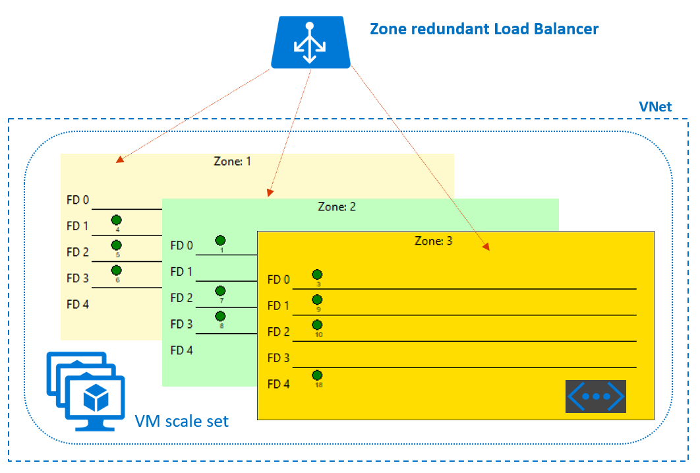

# Azure VM scale set Availability Zones preview

Last update: 10/5/2017.

Welcome to the Azure VM scale sets on Availability Zones preview. For more information about Availability Zones, go here: [Overview of Availability Zones in Azure (Preview)](https://docs.microsoft.com/en-us/azure/availability-zones/az-overview).

Note: Availabliity Zones are initially available only in these regions: **West Europe** & **East US 2** 

### Single zone
A _zonal_ scale set is a scale set that is pinned to a single Availability Zone. The VMs are evenly distributed between the zones. Zonal scale sets are currently available in public preview.

What does pinning a scale set to a single zone give you that a regular (regional) scale set does not?

Pinning a scale set to a zone enables you to create multiple scale sets, each pinned to different zones, and therefore guarantee they are on physically isolated hardware.

### Example zonal scale set

### Zone redundant
A _zone-redundant_ scale set is a scale set that is spread across more than one availablity zone.

You can sign up to the zone redundant scale set preview here: [https://aka.ms/xzonevmss](https://aka.ms/xzonevmss)

Note: This template will not work unless your Azure subscription has special feature flags enabled.

### Zone redundant load balancer (Load Balancer 'Standard')
Zonal and zone redundant scale sets work with the new Load Balancer 'Standard SKU'. See [Azure Load Balancer Standard overview (Preview)](https://docs.microsoft.com/en-us/azure/load-balancer/load-balancer-standard-overview) for more info.

To register for the zone redundant load balancer 'Standard' preview click here: [https://aka.ms/azenroll](https://aka.ms/azenroll)

Load Balancer 'Standard' is currently available in the following regions (AZ supporting regions in bold): 
**East US 2**, Central US, North Europe, West Central US, **West Europe**, Southeast Asia.

Here is an example which also relies on the _VM Scale Sets manually triggered rolling image upgrade_ preview. It uses a Load Balancer 'Standard' sku to provide an applicaiton health probe.

The new load balancer can also load balance between scale sets of up to 1000 VMs, and multiple scale sets.

### Notes

#### Zone failure
If a zone goes down, a scale set will not automatically scale-out. An application will need to manually increase scale set capacity to scale out to other zones (or link it to autoscale settings like CPU etc.).

#### zoneBalance setting

Zone redundant scale sets have a _zoneBalance_ boolean property: 
- True if you want VMs strictly evenly distribution across zones. 
- False if you doesn’t need strictly even distribution. VMs will be allocated to good zones if there is a zone outage when creating/scaling out. Default value: true.

If this is set to False and you scale out your scale set during a zone failure by increasing capacity, you’d be able to get back up to original capacity using other zones. 

